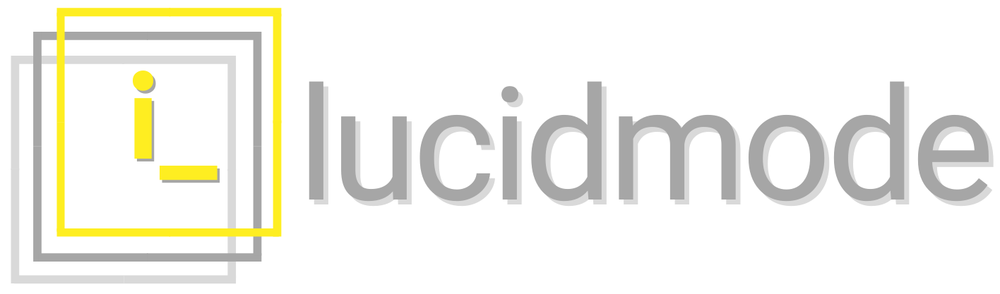

|

|

.. currentmodule:: lucidmode

``lucidmode`` is built using similar elements and structure as the API of `scikit-learn` and `TensorFlow`, so in order to preserve standard references like ``fit``, ``predict``, ``predict_proba`` and others.

Next, read some more details about What are the key elements of :ref:`Explainable Artificial Intelligence <introduction>`, and what tools does ``lucidmode`` provide.

Contents
--------

.. toctree::
   :maxdepth: 1
   
   introduction
   installation
   models
   functions
   visualizations
   examples
   roadmap
   releases
